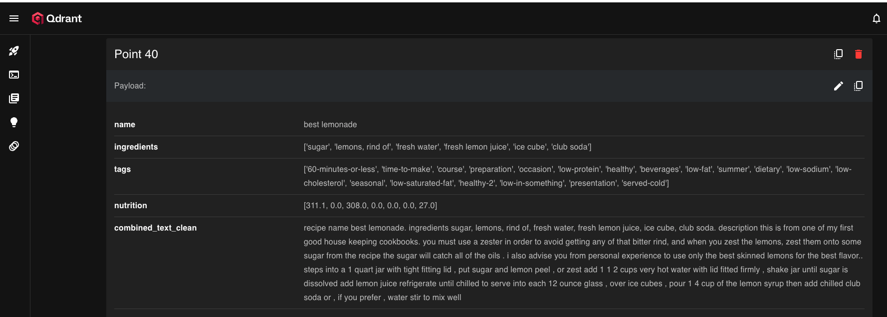
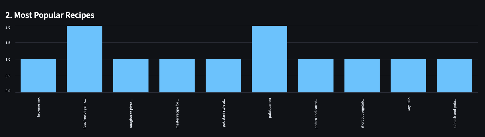

# 👩🏻‍🍳 Personal Food Recipe Assistant 🧑🏻‍🍳

**Making cooking easy, quick, and intelligent!**


This project helps users find the perfect recipe in seconds, using semantic search powered by vector embeddings and open-source LLMs.

---

## 🧭 About the Project

This project was developed as part of the **[LLM Zoomcamp by DataTalks.Club](https://github.com/DataTalksClub/llm-zoomcamp/blob/main/project.md#evaluation-criteria)** — an open, hands-on course designed to help learners build, evaluate, and deploy real-world **Large Language Model (LLM)** applications.

LLM Zoomcamp focuses on:

* Retrieval-Augmented Generation (RAG)
* Data ingestion and vector databases
* Model evaluation and monitoring
* Deployment and reproducibility best practices

---

## 🥘 Project Overview 

Cooking can be time-consuming when you have to browse endless recipes.
**Personal Food Recipe Assistant** makes it easy, just describe what you want to cook, like:

> “High-protein breakfast with oats”

and it instantly finds the most relevant recipes using **semantic search**.

This means the app understands *meaning*, not just keywords.

---

## 📊 Dataset — Recipes.csv

**Source:** [Kaggle Food.com Recipes and Interactions](https://www.kaggle.com/datasets/shuyangli94/food-com-recipes-and-user-interactions?resource=download&select=RAW_recipes.csv)

**About the dataset:**

* Over **230K recipes** with details like ingredients, cooking steps, and metadata.
* Perfect for NLP applications such as semantic retrieval and text generation.
* Used only the **RAW_recipes.csv** file (from Kaggle) to build the knowledge base.
* The dataset can be downloaded directly from Kaggle or from [Google Drive](https://drive.google.com/drive/folders/18bgIVGCDvC8by-9pD3WSTqa-Z_CGK_qw?usp=drive_link). Since the file is quite large, it could not be uploaded to this repository.

---

## 💡 Why Open Source LLMs?

Initially, the app used OpenAI models, but API usage errors occurred due to limits.
To ensure stability and accessibility, the project switched to open-source LLMs from Hugging Face.

---

## ⚙️ RAG Flow

Data preparation → Embeddings Generation → Stored in Qdrant → Query via LLM → Response generated  (Implemented in **`rag.ipynb`**)

**1. Data Preparation**
The data is cleaned, and all recipe details are combined into one field — `combined_text_clean`. This helps the model understand each recipe holistically.

**2. Embedding Generation**
Each recipe is transformed into a **vector embedding** using
`SentenceTransformer('all-MiniLM-L6-v2')`.
These embeddings capture *meaning*, not just words.

**3. Vector Storage (Qdrant)**
The embeddings are stored in **Qdrant**, a high-performance open-source vector database.
Here’s a sample record stored in Qdrant:  

**4. Semantic Retrieval**
When a user types a query like *“quick vegan breakfast”*, it’s also converted into an embedding.
Qdrant then searches for the **most semantically similar recipes** — not just ones with matching words, but those that *mean* the same thing.

**5. Augmentation & Generation**
The retrieved recipe data is passed to the **LLM (TinyLlama-1.1B-Chat)**.
The model reads the recipe context and generates rich, relevant answers.

**6. Final Output**
You get personalized, accurate, and delicious recipe ideas instantly, powered by **semantic search + intelligent generation**.

💡 **In short:**
The RAG flow combines **embeddings**, **vector search (Qdrant)**, and **LLM generation** to make cooking *smarter, faster, and more fun!*

---

**🧠 RAG Pipeline**

| Component             | Purpose                    | Library               |
| --------------------- | -------------------------- | --------------------- |
| `all-MiniLM-L6-v2`    | Embedding generation       | sentence-transformers |
| `TinyLlama-1.1B-Chat` | Text generation            | transformers          |
| `Qdrant`              | Vector storage & retrieval | qdrant-client         |

---

## 🧪 Evaluation

### 🔹 Retrieval Evaluation

* Conducted in **`evaluation.ipynb`**
* Used **20 test queries** (`ground_truth.csv`)
* Compared 3 embedding models (all 384-dim)
  ✅ **Best model:** `all-MiniLM-L6-v2`
  → Achieved **~95% accuracy** on retrieval tasks.

### 🔹 LLM Evaluation

* Tested with **2 different prompts**
* More detailed prompt produced richer, context-aware instructions
* Chosen for final deployment after manual review

---

## 📥 Ingestion Pipeline

Due to the large size (>1GB) of the embeddings file, full automation was not possible. A **semi-automated ingestion pipeline** is demonstrated.

---

## 💻 User Interface (Streamlit)

An easy-to-use **Streamlit** web app was built for interaction.

---

## Monitoring Dashboard

Built-in Streamlit dashboard provides real-time insights into application usage:

**Tracked Metrics:**
- Total queries and unique recipes searched
- User satisfaction rate (👍/👎 feedback)
- Query trends over time
- Most popular recipes
- Activity patterns by hour

User feedback is collected after each recipe recommendation and stored in `feedback.csv` 
for continuous monitoring and improvement.

📊 Dashboard screenshots can be found in the [`images/`](images/) folder.

Example: 

## ⚙️ Setup Instructions


## 🧭 First step is Qdrant Setup — Step-by-Step Guide

Qdrant stores your recipe embeddings and performs **semantic (vector) search**.

### 🪄 Create a Free Qdrant Cloud Account

1. Go to [Qdrant Cloud](https://cloud.qdrant.io/).
2. Create a free cluster (Free Tier).
3. Copy your **Cluster URL** and **API Key**.

Example:

```
QDRANT_URL="https://your-project-name.qdrant.cloud"
QDRANT_API_KEY="your_api_key"
```

Add these values to your `.env` file.

### 🧠 Test the Connection

```python
from qdrant_client import QdrantClient
import os

client = QdrantClient(
    url=os.getenv("QDRANT_URL"),
    api_key=os.getenv("QDRANT_API_KEY")
)
print(client.get_collections())
```

If you get a list (or empty list), your connection works ✅

---

## 🍱 Uploading Embeddings to Qdrant

Because the embedding file is large (~1 GB), it’s stored externally.
Download it from Google Drive:
🔗 **[Download Embeddings (.pkl)](https://drive.google.com/drive/folders/18bgIVGCDvC8by-9pD3WSTqa-Z_CGK_qw?usp=drive_link)**

### 1️⃣ Load the Embeddings

```python
import pickle
import pandas as pd

with open("recipe_embeddings.pkl", "rb") as f:
    data = pickle.load(f)

print(f"Loaded {len(data)} recipes with embeddings.")
```

### 2️⃣ Connect to Qdrant

```python
import os
from qdrant_client import QdrantClient

qdrant_client = QdrantClient(
    url=os.getenv("QDRANT_URL"),
    api_key=os.getenv("QDRANT_API_KEY")
)
```

### 3️⃣ Create the “recipes” Collection

```python
qdrant_client.recreate_collection(
    collection_name="recipes",
    vectors_config={"size": 384, "distance": "Cosine"}
)
```

### 4️⃣ Upload in Batches

```python
from tqdm import tqdm

batch_size = 500  # batch size

for i in tqdm(range(0, len(data), batch_size)):
    batch = data.iloc[i:i+batch_size]

    points = [
        {
            "id": int(row["id"]),
            "vector": row["embedding"],
            "payload": {
                "name": row["name"],
                "ingredients": row["ingredients"],
                "tags": row.get("tags", None),
                "nutrition": row.get("nutrition", None),
                "combined_text_clean": row["combined_text_clean"]
            }
        }
        for _, row in batch.iterrows()
    ]

    qdrant_client.upsert(
        collection_name="recipes",
        points=points
    )
```

✅ This uploads embeddings in chunks for efficiency and reliability.

---

### After setting up Qdrant, navigate to the cloned repository and follow these steps:

## To Run Locally:

### 1️⃣  Repository is cloned by:

```bash
git clone https://github.com/selesselvan/food-recipe-zoomcamp
cd food-recipe-zoomcamp
```

### 2️⃣ Create Virtual Environment and Install Dependencies

```bash
pip install -r requirements.txt
```

### 3️⃣ Set Up Environment Variables

Create a `.env` file in your root directory:

```
QDRANT_URL="https://your-project-name.qdrant.cloud"
QDRANT_API_KEY="your_api_key"
```

### 4️⃣ Run the App

```bash
streamlit run app.py
```

Your app will be live at 👉 [http://localhost:8501](http://localhost:8501)

---

## 🐳  Alternatively, To Run with Docker:


**Folder structure:**

```
food-recipe-zoomcamp/
├── Dockerfile
├── docker-compose.yml
├── requirements.txt
├── app.py
├── .env
├── feedback.csv
└── .gitignore
```

**Run with Docker:**

```bash
docker-compose up --build
```

App runs on [http://0.0.0.0:8501](http://0.0.0.0:8501)

🎥 You can **download and watch the application demo** from the `images` folder: [video.mov](images/video.mov)


---

## 🧩 Evaluation Criteria Summary
This project was completed following the DataTalksClub LLM Zoomcamp evaluation criteria. Every step, from data ingestion to semantic retrieval and LLM generation, was implemented to ensure all core evaluation points are satisfied. Below is a detailed summary of how the project meets each criterion:

| Criterion                | Score  | Description                                                                |
| ------------------------ | ------ | -------------------------------------------------------------------------- |
| **Problem Description**  | ✅     | Clear explanation of goal |
| **Retrieval Flow**       | ✅     | Knowledge base + LLM via RAG                                               |
| **Retrieval Evaluation** | ✅     | Multiple embedding models tested                                           |
| **LLM Evaluation**       | ✅     | Multiple prompt tests with comparison                                      |
| **Interface**            | ✅     | Streamlit UI built                                                         |
| **Ingestion Pipeline**   | ✅     | Semi-automated ingestion                                                   |
| **Monitoring**           | ✅     | Feedback mechanism via `feedback.csv`                                      |
| **Containerization**     | ✅     | Full docker-compose setup                                                  |
| **Reproducibility**      | ✅     | Clear setup instructions & working demo                                    |

---


### 🚀 Finally 

**Personal Food Recipe Assistant** brings together RAG, open-source LLMs, and semantic search to turn recipe discovery into an effortless, intelligent experience.


👩🏻‍🍳 *Happy Cooking and Coding!* 🧑🏻‍🍳
*— Personal Food Recipe Assistant Team*

